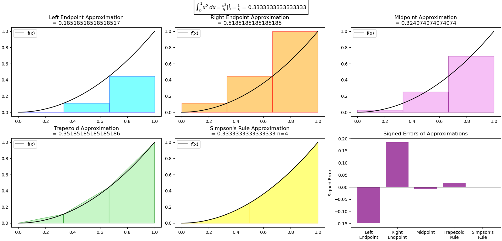
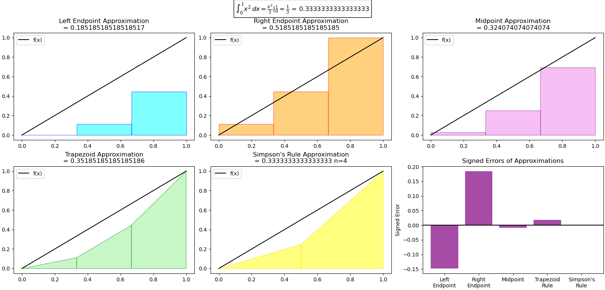
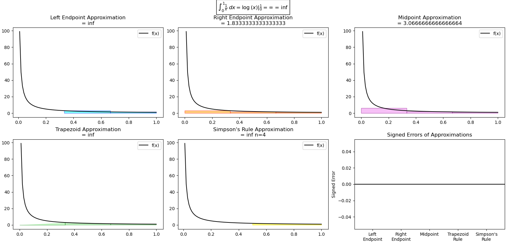

# Numerical-Integral-Approximation
Uses matplotlib to visualize numeric integration techniques.

## Purpose

1. Visualize left endpoint, right endpoint, midpoint, trapezoid, and simpson's approximations of integrals.
2. Graphically show the error each method gives for a given function

## Requirements
1. [Python](https://www.python.org)
    1. [Matplotlib](https://matplotlib.org/)
    2. [Sympy](https://sympy.org/)
    3. [Numpy](https://numpy.org/)


Install requirements with command:
```pip install matplotlib sympy numpy```
If that doesn't work, try this:
```pip3 install matplotlib sympy numpy```
If still not working ensure pip is installed:
```python -m ensurepip --upgrade```


## Instructions
1. Run ```main.py```
2. Follow prompts to enter:
    * Function
    * Variable in function (x, t, etc)
    * Lower bound for integral
    * Upper bound for integral
    * Number of subintervals(# of Rectangles/Trapezoids)
    * Quality of Graph  (Independant of Riemann Sum calculations just number of points used to plot)

3. Press Enter

## Examples
### Default case, when user doesn't give function. 


### Same function as above, but with quality set to 2 instead of 1000
Notice that sum calculations are the same, only the quality of plot is affected.


## Known Issues:

1. Divide by zero is not handled. If an endpoint is undefined the approximation will give nan or inf.




